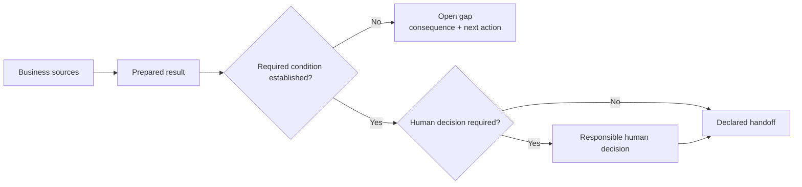

# IMPACTS Protocol

**Keep business sources, work, checks and decisions connected in ordinary files.**

IMPACTS is a file-based method for people and file-capable agents. It starts with existing business files. For bounded, repeatable work, its optional Core adds versioned file contracts; the Python CLI supplies templates, structural validation and hashing. The CLI does not execute customer work.

[Prepare a useful offer draft](FIRST-WIN.md) · [Agent start](#version-and-entry-points) · [Install or validate](#optional-technical-use) · [Trust and security](#trust-and-security-boundaries) · [Deutsch](02_protocol/translations/de.md)

**First result, no installation:** prepare an internal offer draft with source links, open price and delivery questions, and a named next action. The supplied exercise is synthetic and authorizes no customer commitment.

Agents may interpret and draft. Required calculations need executed deterministic checks. Human decisions remain human. Missing facts remain open. Validation, hashes and Git history establish only their named technical conditions.

> **Agent start:** Resolve the [protocol version and source](#version-and-entry-points), read [CONTEXT.md](CONTEXT.md), and follow one selected route. Keep customer material in its customer workspace.

## Relationship to ICM

ICM supplies the technical foundation: folder-directed context, plain-file structure and inspectable agent wiring. IMPACTS builds methodically on those principles at the business layer: a first-principles harness for understanding a company and connecting its sources, work, checks, calculations and human decisions. The acronym ICM is also used for personal folder systems; that usage is separate and does not define IMPACTS. This relationship requires neither an ICM installation nor one shared folder.

IMPACTS is not a personal mega-folder for everything. Customer work remains in each customer's repository or workspace; the protocol Core stays small and holds only typed contracts for bounded, repeatable work.

## Follow your task

| You have… | Start here | First completion |
|---|---|---|
| An offer to clarify | [First contribution](FIRST-WIN.md) | Internal draft, source links, explicit gaps and next action |
| Notes or an undocumented business | [Form selection](02_protocol/impacts-architect/references/formwahl.md) | Smallest suitable existing home for facts and open questions |
| Existing repositories or a shared source change | [Architect Restructure mode](02_protocol/impacts-architect/SKILL.md#restructure-mode) | Owners, revisions, consumers, migration and recovery made explicit |
| A bounded, repeatable result | [Build method](02_protocol/impacts-method.md) | Candidate definition with result, inputs, checks and routes |
| An existing bound Run | Its `vorgaenge/<id>/CONTEXT.md` and linked inputs | Next permitted action or a specific blocker under the bound revision |
| A calculation to check | [Computation example](06_evaluations/computation-walk/CONTEXT.md) | Conditional result or focused missing-input question |



This diagram is orientation. The [ontology](02_protocol/ontology.md) owns evidence and valid inference; the [Capability contract](02_protocol/capabilities.md) owns reusable operations, handoffs and authority boundaries.

## Get the protocol

For new work, get the complete source archive from the [v0.3.14 release](https://github.com/Melvinanalytics/impacts-protokoll/releases/tag/v0.3.14), or clone that tag:

```bash
git clone --branch v0.3.14 --depth 1 https://github.com/Melvinanalytics/impacts-protokoll.git
cd impacts-protokoll
```

Keep the complete source together: method, Architect, references, templates and examples. Reading the archive needs no installation. A copied Architect folder is incomplete even when its `references/` folder is present: it also depends on parent protocol files and root guidance. The wheel contains the CLI, schemas and templates; using its generated workspace with the method requires the matching complete source.

## Version and entry points

The source edition is `[project].version` in the root [pyproject.toml](pyproject.toml). Run `impacts --version` for package metadata identity, or `python -m pip show impacts-protocol` in the Python environment that supplies `impacts`. Without installed metadata, the CLI labels a source `pyproject.toml` fallback or reports an unknown version. Published package version `X` corresponds to release tag `vX`. Metadata identifies an edition; it does not prove the loaded code's bytes, an exact source revision or compatibility. In particular, a modified editable install or a source checkout shadowing another installation still needs its actual source identity recorded.

Record the actual source location and identity in the customer's existing root `CONTEXT.md`. In a Git checkout, use `git rev-parse HEAD` and `git status --short` to record the commit and any local changes; retain a release tag only when it identifies that source. Without Git, record the archive's actual origin, tag or filename and local source location; retain an available checksum and describe local changes. An archive filename alone is not proof of its contents. Keep unavailable identity or conflicting versions explicit; obtain the corresponding source before applying a rule whose version cannot be resolved. A checkout beyond a release or modified files must be identified as such, even if the edition in `pyproject.toml` is unchanged.

| Starting surface | Entry and completion |
|---|---|
| Complete protocol source | Read this protocol's root [CONTEXT.md](CONTEXT.md), then the selected task route. Keep customer work in its own folder. |
| New or existing customer folder | Read that folder's `CONTEXT.md`; record or follow its actual protocol source/revision and working language. Resolve `02_protocol/` paths against that source. |
| Existing Core Run | Start at its `vorgaenge/<id>/CONTEXT.md` and declared inputs. Preserve its bound Application, sources and language; a newer installed package or protocol does not upgrade them. |
| Wheel or copied skill with missing source | Recover the source/revision from provenance: published versions from [releases](https://github.com/Melvinanalytics/impacts-protokoll/releases), unreleased revisions from the recorded original repository or file snapshot. Resolve the needed links there before applying their rules. |

Entry is resolved when the task's router, source identity and required links are reachable without substituting `main`, another release or model memory. If something is missing, retain the gap and next action; independent permitted preparation can continue. Changes to existing definitions follow [Reviewed correction](02_protocol/impacts-method.md#reviewed-correction), while earlier bound work retains its revisions.

The [root router](CONTEXT.md) locates authorities; knowledge and records keep their homes. English owns the protocol. German customer work stays German: [operator guide](02_protocol/translations/de.md) · [language contract](02_protocol/language.md).

## Trust and security boundaries

IMPACTS defines file contracts and authority boundaries. The selected execution environment remains responsible for access, credentials, isolation, retention and external effects.

| Concern | Boundary |
|---|---|
| Customer material | Keep it in the customer repository or workspace. Public examples and evaluations are synthetic. |
| Access and credentials | The configured harness supplies them outside workstep files; availability does not grant permission. |
| Instruction and data boundary | Only the harness's declared, reviewed instruction surfaces may guide processing. Business source content and tool responses are untrusted data; neither they nor instruction files can expand configured permissions, routes or authority. |
| Human decisions | Agents do not create human decisions. A `human:<id>` value records attribution; it does not authenticate anyone. |
| Validation | `impacts validate`, hashes and Git establish only their named structural or byte conditions, not source truth, permission or business acceptance. |
| External writes | A write is a separately permitted effect with a target, scope, authority, current-state check and confirmation evidence. |
| Execution | Core and the CLI do not execute worksteps. A configured harness must support the selected operations, checks, handoffs and human boundaries. |

Authorities: [workstep processing](02_protocol/templates/arbeitsschritt.md#processing) · [enforcement and completion](02_protocol/ontology.md#enforcement-and-completion) · [human gates](02_protocol/capabilities.md#signale-und-human-gate) · [record writeback](02_protocol/capabilities.md#r%C3%BCck%C3%BCbertragung-in-gesch%C3%A4ftsrecords)

## Optional technical use

| Mode | Obtain | Requires | Boundary |
|---|---|---|---|
| Knowledge only | Complete tagged source retained as evidence, plus its reviewed text-only projection | Text editor or managed knowledge source | No code execution or automatic adoption of embedded instructions; retain source paths and release identity |
| Read-only source use | Complete tagged source | Person or permitted file-capable agent | Review harness-recognized instruction files before use; other retrieved content grants no permission or action authority |
| Local CLI | Complete tagged source or verified release wheel | Python 3.11+ in an isolated environment | `init`, `template`, `validate` and `hash`; no workstep execution |
| Executable action | Customer workspace and separately reviewed harness or service | Actual sources, permissions, operations and checks | Deployment-specific runtime and authority; least privilege and explicit effects |

For managed enterprise knowledge use, start with **Knowledge only**: identify one named release, record its full source commit, hash the exact acquired source, retain it as a write-protected internal snapshot, and publish a reviewed text-only projection to tenant-controlled read-only storage. Record the source-to-projection mapping, approved revision, complete intake manifest and artifact hashes. Record approved dependencies and environment controls separately if code will be installed. This internal snapshot neither makes the public release immutable nor proves publisher or build provenance. Enable no tools, actions, live public-website grounding or automatic upstream refresh in the pinned knowledge configuration. Executable integration is a separate deployment review.

The projection is a derived reading surface, not a replacement authority or a complete protocol source. Record its included source paths and omissions. For each intended question, make the required passages available to the selected retriever, including needed domain definitions, observation claims, rules and supporting evidence excerpts. Do not assume that the retriever follows links inside an indexed document. Required linked passages must remain reachable at the bound revision through separately included projection material or the retained source. An omitted, inaccessible or stale required passage remains an explicit gap and restricts only the dependent conclusion or action.

Edition v0.3.14 documents this customer-prepared intake path; it does not supply a publisher-attested knowledge projection, enterprise intake manifest, dependency bundle, build-provenance attestation or connector integration. The enterprise custodian prepares and records those materials for its environment. Release checksums cover only the assets named in that checksum file. For **Local CLI**, checking the IMPACTS wheel does not verify or freeze its dependencies: ordinary `pip` can resolve and download them. Enterprise executable intake must separately approve and hash-pin the complete dependency set or use an approved internal package source.

Call machine validation for a needed check when a suitable checker is available. An unavailable or failed check leaves its condition unestablished: preparation continues while the dependent claim or action waits. Explain progress, consequence and next action; retain raw diagnostics for maintainers. [Form selection](02_protocol/impacts-architect/references/formwahl.md#tooling-stopp) owns this boundary.

The CLI supplies `init`, `template`, `validate` and `hash`. Application-only validation checks implemented structure, references and paths without Git. Current historical Run validation needs Git and committed Application binding. Neither establishes definition completeness or execution; a configured harness executes structured Runs.

For the CLI, use Python 3.11+. In your chosen working folder, create and activate a virtual environment (shown for macOS/Linux):

```bash
python3 -m venv .venv
source .venv/bin/activate
```

Choose one installation source:

- **Complete checkout:** from its root, run `python -m pip install -e .`.
- **Release wheel:** download the wheel, complete source archive and `SHA256SUMS` from the release above into one folder. From that folder, verify every listed asset with `shasum -a 256 -c SHA256SUMS` (macOS/Linux), then install with `python -m pip install ./impacts_protocol-0.3.14-py3-none-any.whl` only if the complete check passes.

Follow [Version and entry points](#version-and-entry-points) to identify the installed package and obtain its complete source. Then, outside the intended new customer folder:

```bash
impacts init ../impacts-demo
impacts validate ../impacts-demo
impacts template arbeitsschritt
```

`init` creates an empty Core workspace (`CONTEXT.md`, `applications/`, `vorgaenge/`), refuses an existing target and creates no Git repository or runnable process. Keep the customer workspace separate from the protocol source. Add `--language de` to `init` or `template` for German. Initialize Git at the Core root before committing an Application for Run binding.

Explore the [Application template](02_protocol/templates/application.md), [schemas](02_protocol/schemas/), [Capabilities](02_protocol/capabilities.md) and [Architect skill](02_protocol/impacts-architect/SKILL.md). The programmed [offer walk](06_evaluations/offer-walk/CONTEXT.md) retains checked synthetic preparation at a pending human gate; the [cold walk](06_evaluations/cold-walk/CONTEXT.md) exercises loops, waits, synthetic gates and transport.

### CLI output and text input

`impacts validate <path>` remains silent on success and prints issue code, path and message on failure. Add `--verbose` to record package metadata identity on stderr. `impacts hash <attempt> <surface>...` prints only the digest on success; operational errors go to stderr. Human-readable message wording is diagnostic, not a stable parsing interface.

| Exit code | Meaning |
|---|---|
| `0` | The requested operation or structural validation succeeded. |
| `1` | Validation or an expected operation failed, including an invalid hash surface or an existing `init` target. |
| `2` | CLI arguments are invalid. |

A valid `wartend` entry or pending human gate is not a validation failure. Exit `0` establishes neither business completion nor approval. Issue codes such as `schema.invalid`, `hash.mismatch` and `trust.invalid` distinguish failed checks within exit `1`.

Markdown input accepts UTF-8 with one optional leading BOM and LF or CRLF line endings. Repeated leading BOMs are malformed input. Strict YAML ingestion rejects duplicate and non-string mapping keys; it retains the existing safe YAML scalar rules, so quote string values such as `NO`, `on` and `off`. Hashing always uses raw file bytes: BOMs, line endings and Unicode normalization can change a digest even when text looks the same.

## Develop and contribute

Read [AGENTS.md](AGENTS.md) and the nearest `CONTEXT.md`; update rules at their existing homes.

```bash
python -m pip install -e ".[test]"
python -m pytest -q
python3 06_evaluations/complexity-budget/check.py
```

The test extra supplies pytest, Hypothesis for generated boundary cases, and setuptools for packaging tests using `--no-build-isolation`; these are not runtime dependencies. Run evaluations from their linked guides. Local checks cover Python 3.11/3.14 on macOS. The distribution supplies CLI, schemas and templates; use the complete checkout for method, Architect, examples and tests.

Submit [issues](https://github.com/Melvinanalytics/impacts-protokoll/issues) or [pull requests](https://github.com/Melvinanalytics/impacts-protokoll/pulls) with revision, expected/observed behavior and a synthetic case. Exclude private customer material; update affected German surfaces and report checks not performed. Tests, files-only consumer checks and release decisions are separate.

[Apache License 2.0](LICENSE).
